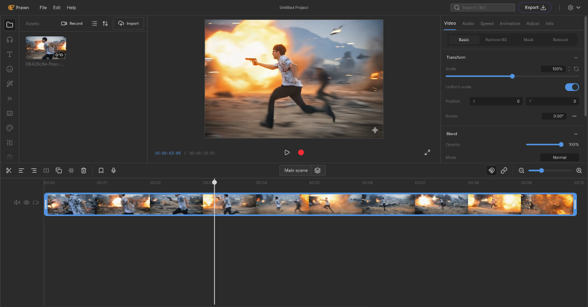

# NVAI Video Editor (Prawn)



**NVAI Video Editor** (codenamed **Prawn**) is a powerful, open-source video editor that runs entirely in your browser. It is designed to be simple, privacy-focused, and accessible, built on modern web technologies.

## 🦐 Ecosystem

This project is part of the **Video Audio Editor** ecosystem, which also includes:
*   **[SHRIMP](https://github.com/vnt87/shrimp):** A powerful, browser-based Image Editor.
*   **PRAWN (This Project):** A comprehensive Video & Audio Editor.

Both projects share a design philosophy of being local-first, privacy-respecting, and free to use.

## 🚀 Key Features

*   **Local-First Editing:** Most processing happens directly in your browser using WebAssembly (FFmpeg via `@ffmpeg/ffmpeg`), ensuring privacy and speed.
*   **Multi-Track Timeline:** Intuitive timeline for arranging video, audio, and image clips.
*   **Asset Management:** Drag-and-drop support for managing your media assets.
*   **Privacy Focused:** Your content stays on your device. Optional AI features use zero-knowledge encryption for processing.
*   **Clean UI:** Built with a premium, industrial design language (SHRIMP UI) for a distraction-free editing experience.

## 🛠️ Tech Stack

*   **Framework:** [Next.js](https://nextjs.org/) (App Router)
*   **Runtime:** [Bun](https://bun.sh/)
*   **Styling:** [Tailwind CSS](https://tailwindcss.com/)
*   **UI Components:** [Radix UI](https://www.radix-ui.com/), [Lucide React](https://lucide.dev/)
*   **State Management:** [Zustand](https://github.com/pmndrs/zustand)
*   **Video Processing:** [FFmpeg.wasm](https://ffmpegwasm.netlify.app/)
*   **Backend Services:**
    *   **Appwrite:** For backend logic and potential future features.
    *   **Supabase:** Alternative/legacy backend integration.
*   **Utilities:** `sonner` (toasts), `vaul` (drawers).

## 📂 Directory Structure

```
src/
├── app/              # Next.js App Router pages and layouts
├── components/       # React components
│   ├── editor/       # Editor-specific components (Timeline, Player, etc.)
│   ├── ui/           # Reusable UI components (Buttons, Dialogs, etc.)
│   └── ...
├── constants/        # Site-wide constants and configuration
├── hooks/            # Custom React hooks
├── lib/              # Utility functions and libraries
├── stores/           # Zustand state stores
└── ...
```

## 🐳 Docker Deployment

You can run Prawn using Docker and Docker Compose. This is the easiest way to get the editor and its auxiliary services (like STT) running locally.

### Prerequisites

- [Docker](https://www.docker.com/get-started)
- [Docker Compose](https://docs.docker.com/compose/install/)

### Running with Docker Compose

1.  **Clone the repository:**
    ```bash
    git clone https://github.com/vnt87/prawn.git
    cd prawn
    ```

2.  **Set up environment variables:**
    Copy `.env.example` to `.env.local` and fill in the required values.
    ```bash
    cp .env.example .env.local
    ```

3.  **Start the services:**
    ```bash
    docker compose up -d
    ```

4.  **Access the application:**
    Open [http://localhost:1338](http://localhost:1338) in your browser.

### Building the Docker Image Manually

If you want to build the image locally without using Docker Compose:

```bash
docker build -t prawn .
docker run -p 1338:1338 prawn
```

## CREDITS

**Author:** [Nam Vu](https://namvu.net)

This project is a fork of [OpenCut](https://github.com/OpenCut-app/OpenCut). We acknowledge and appreciate the work of the original authors and the open-source community.

Special thanks to: [OpenCut](https://github.com/OpenCut-app/OpenCut) (original codebase), [Remotion](https://remotion.dev/) (animation system), [FFmpeg.wasm](https://ffmpegwasm.netlify.app/) (video processing), [Radix UI](https://www.radix-ui.com/) (components), [Lucide](https://lucide.dev/) (icons), [WaveSurfer.js](https://wavesurfer.xyz/) (audio visualization), [mediabunny](https://github.com/nicktomlin/remotion-mediabunny) (media handling), [Zustand](https://github.com/pmndrs/zustand) (state management).

## License

This project is open-source.
