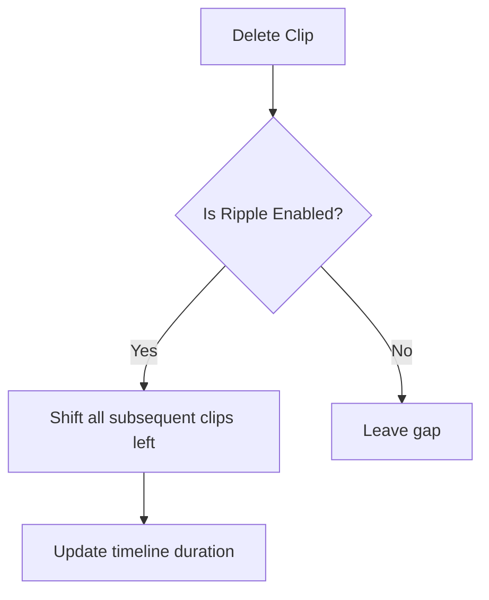

# Core Video Editing Features Gap Analysis

> **Analysis Date:** February 2026  
> **Project:** Prawn Video Editor  
> **Scope:** Core editing capabilities (excluding filters, AI, templates)

---

## Executive Summary

This report identifies **core video editing features** missing from Prawn compared to CapCut and Final Cut Pro. Core features are fundamental editing capabilities that professionals expect in a video editor—not special effects, AI tools, or templates.

### What's Currently Implemented

| Category | Features |
|----------|----------|
| **Timeline** | Multi-track (video, audio, text, sticker), basic trimming, bookmarks |
| **Transform** | Scale, position, rotation, uniform scaling |
| **Opacity/Blend** | Opacity slider, 12 blend modes |
| **Speed** | Speed control (0.1x-10x), duration adjustment |
| **Audio** | Volume, fade in/out |
| **Color Adjust** | Temperature, tint, saturation, brightness, contrast, highlights, shadows, whites, blacks, sharpen, clarity, fade, vignette |
| **Animations** | 15+ animation types (fade, slide, zoom, spin, Ken Burns, spring animations) |
| **Masks** | Shape masks (UI exists, implementation in progress), feather, round corners |
| **Transitions** | Entry/exit animations (but not clip-to-clip transitions) |
| **Text** | Rich text formatting, text effects (typewriter, wave, glitch, neon glow) |

---

## Missing Core Features

### 1. Keyframe Animation System

**Status:** ❌ Not Implemented

**What CapCut/FCP Offer:**
- Keyframe-based animation for any property (position, scale, opacity, rotation, effects)
- Linear and Bezier curve interpolation
- Property graphs/editors for precise control
- Copy/paste keyframes across clips

**Current State in Prawn:**
- Only static transform values
- Entry/exit animations are pre-defined, not keyframe-driven
- No keyframe UI or data structure

**Impact:** HIGH — Keyframes are fundamental to professional motion graphics and animated effects.

---

### 2. Compound Clips / Nesting

**Status:** ❌ Not Implemented

**What CapCut/FCP Offer:**
- Group multiple clips into a single "compound clip" or "nest"
- Edit compound clip contents in a separate timeline
- Apply effects to entire compound clip
- Reuse compound clips across projects

**Current State in Prawn:**
- No concept of clip nesting
- All clips exist in a single flat timeline

**Impact:** MEDIUM-HIGH — Important for complex projects and organization.

---

### 3. Multi-Camera Editing

**Status:** ❌ Not Implemented

**What CapCut/FCP Offer:**
- Sync multiple camera angles by audio or timecode
- Switch between angles in real-time during playback
- Create multi-camera source clip from multiple clips

**Current State in Prawn:**
- No multi-camera synchronization
- No multi-camera switcher UI or functionality

**Impact:** MEDIUM — Important for event videos, interviews, action scenes.

---

### 4. Proxy / Low-Resolution Editing

**Status:** ❌ Not Implemented

**What CapCut/FCP Offer:**
- Work with proxy (low-res) files for smooth editing
- Automatic quality switch during export
- Generate proxies for 4K/8K footage

**Current State in Prawn:**
- Works with original resolution files directly
- No proxy generation or management

**Impact:** MEDIUM — Critical for 4K+ workflows, less important for 1080p projects.

---

### 5. Professional Color Grading (Curves / Color Wheels)

**Status:** ⚠️ Partial

**What CapCut/FCP Offer:**
- RGB curves for precise color control
- Color wheels (shadows, midtones, highlights)
- HSL qualifier for selective color adjustment
- Color match tool

**Current State in Prawn:**
- Basic color adjustments (brightness, contrast, temperature, tint)
- No RGB curves
- No HSL qualifier
- No color match functionality

**Impact:** MEDIUM — Current adjustments cover basics; curves needed for pro work.

---

### 6. Professional Audio Editing

**Status:** ⚠️ Basic

**What CapCut/FCP Offer:**
- Audio keyframes for volume automation
- EQ / parametric equalizer
- Noise reduction
- Compressor/limiter
- Audio ducking (auto-lower music when voice detected)
- Audio effects (reverb, delay, etc.)

**Current State in Prawn:**
- Basic volume slider per clip
- Fade in/out
- No audio keyframes
- No EQ or effects

**Impact:** MEDIUM — Basic mixing exists; audio effects needed for pro results.

---

### 7. Clip-to-Clip Transitions

**Status:** ⚠️ Partial

**What CapCut/FCP Offer:**
- Drag-and-drop transitions between adjacent clips
- Transition duration control
- Transition effects (dissolve, wipe, slide, zoom, spin)

**Current State in Prawn:**
- Entry/exit animations exist (per-clip)
- No transition UI between clips
- No timeline-level transition indicators

**Impact:** MEDIUM — Animation system exists; needs transition-specific UI.

---

### 8. Track-Based vs. Magnetic Timeline

**Status:** ⚠️ Basic

**What CapCut/FCP Offer:**
- Magnetic timeline (auto-close gaps)
- Secondary storylines
- Auditions (preview multiple takes)
- Blade tool / razor for splitting
- Join clips (remove gap)

**Current State in Prawn:**
- Standard track-based timeline
- No magnetic behavior
- No blade/razor tool
- Gap removal requires manual adjustment

**Impact:** MEDIUM — Basic editing works; magnetic features improve workflow speed.

---

### 9. Ripple Delete / Auto-Ripple

**Status:** ❌ Not Implemented

**What CapCut/FCP Offer:**
- Ripple delete (close gaps automatically when deleting)
- Roll/ripple edit (adjust clip without affecting others)
- Slip edit (adjust in/out points without moving clip)
- Slide edit (move clip without affecting duration)

**Current State in Prawn:**
- No ripple delete
- No roll/ripple/slip/slide editing modes

**Impact:** MEDIUM-HIGH — Fundamental to efficient editing workflow.

---

### 10. Speed Ramping / Velocity Curves

**Status:** ⚠️ Basic

**What CapCut/FCP Offer:**
- Variable speed curves (ease in/out)
- Speed presets (slow-mo, fast-forward)
- Maintain audio pitch option
- Frame blending for smooth slow-motion

**Current State in Prawn:**
- Constant speed multiplier (0.1x-10x)
- No velocity curves
- No frame interpolation
- Pitch change disabled (marked "Soon")

**Impact:** MEDIUM — Basic speed works; ramping needed for cinematic effects.

---

### 11. Frame-Accurate Trimming

**Status:** ⚠️ Partial

**What CapCut/FCP Offer:**
- Frame-by-frame trimming in timeline
- Trim handles (extend clip beyond visible area)
- JKL trimming

**Current State in Prawn:**
- Basic trim via drag handles
- No frame-accurate numeric input
- No trim handles

**Impact:** MEDIUM — Basic trimming works; precision tools needed for pro work.

---

### 12. Project Templates / Presets

**Status:** ❌ Not Implemented

**What CapCut/FCP Offer:**
- Save project as template
- Apply aspect ratio presets (9:16, 16:9, 1:1, 4:5)
- Custom export presets

**Current State in Prawn:**
- No project templates
- Export settings exist but no presets

**Impact:** LOW-MEDIUM — Workflow convenience feature.

---

## Priority Matrix

| Priority | Feature | Impact | Effort |
|----------|---------|--------|--------|
| **P1** | Keyframe Animation | High | High |
| **P1** | Ripple Delete / Edit Modes | Medium-High | Medium |
| **P2** | Clip-to-Clip Transitions | Medium | Low-Medium |
| **P2** | Compound Clips / Nesting | Medium-High | High |
| **P2** | Speed Ramping / Velocity Curves | Medium | Medium |
| **P3** | Audio Keyframes / Effects | Medium | Medium |
| **P3** | RGB Curves / Color Grading | Medium | Medium |
| **P3** | Multi-Camera Editing | Medium | High |
| **P4** | Proxy Workflow | Medium | Medium |
| **P4** | Track-Based Enhancements | Medium | Medium |

---

## Architecture Considerations

### Keyframe Implementation

```mermaid
graph LR
    A[TimelineElement] --> B[Keyframes Property]
    B --> C[Keyframe[]]
    C --> D[Keyframe: time, value, easing]
    E[VisualNode] --> F[Interpolate keyframes]
    F --> G[Apply to property at current time]
```

### Ripple Delete Logic



---

## Conclusion

Prawn has a solid foundation for core video editing with:
- ✅ Multi-track timeline
- ✅ Transform/opacity/blend controls
- ✅ Basic color adjustments
- ✅ Animation system (pre-defined)
- ✅ Speed control (constant)

The main gaps are:
1. **Keyframe system** — the biggest missing piece for professional motion graphics
2. **Ripple editing** — fundamental efficiency feature
3. **Transitions** — UI layer on top of existing animation system
4. **Advanced audio** — EQ, keyframes, effects
5. **Color grading** — curves, color wheels, HSL qualifier
6. **Compound clips** — organization and nesting

These align with typical video editor maturity progression from basic → intermediate → professional.
