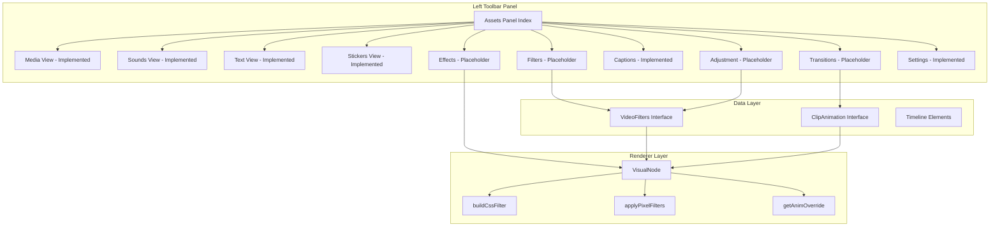

# Left Toolbar Panel Features - Feasibility Report

> **Analysis Date:** February 2026  
> **Project:** Prawn Video Editor  
> **Scope:** Placeholder features in the left toolbar assets panel

---

## Executive Summary

The left toolbar panel contains **4 placeholder features** marked as "Coming Soon":

| Feature | Tab Key | Feasibility | Effort |
|---------|---------|-------------|--------|
| Effects | `effects` | ⭐⭐⭐⭐ High | Medium |
| Transitions | `transitions` | ⭐⭐⭐⭐⭐ Very High | Low-Medium |
| Filters | `filters` | ⭐⭐⭐⭐⭐ Very High | Low |
| Adjustment | `adjustment` | ⭐⭐⭐⭐⭐ Very High | Low |

**Key Finding:** The renderer infrastructure already supports most functionality needed for these features. The [`VideoFilters`](src/types/timeline.ts:64) interface and [`VisualNode`](src/services/renderer/nodes/visual-node.ts:84) class provide the foundation for filters, adjustments, and effects. Transitions would require new timeline element types.

---

## 1. Effects Panel

### Current Status
- **UI Location:** [`src/components/editor/panels/assets/index.tsx:23-27`](src/components/editor/panels/assets/index.tsx:23)
- **Current State:** Placeholder with "Coming Soon" message
- **Icon:** `Wand2` from Lucide

### Proposed Features
Video effects that can be applied to clips:

| Effect | Implementation Path | Complexity |
|--------|---------------------|------------|
| Blur | CSS filter `blur()` on canvas context | Low |
| Glow | Multi-pass canvas rendering | Medium |
| Shadow | Canvas dropShadow filter | Low |
| Pixelate | Canvas drawImage with scaling | Low |
| Glitch | Frame manipulation + displacement | Medium-High |
| VHS/Retro | Color distortion + scanlines | Medium |
| Film Grain | Noise overlay + blend modes | Low-Medium |

### Technical Feasibility: ⭐⭐⭐⭐ HIGH

**Existing Infrastructure:**
- [`VisualNode.renderVisual()`](src/services/renderer/nodes/visual-node.ts:290) already applies CSS filters and pixel-level operations
- [`applyPixelFilters()`](src/services/renderer/nodes/visual-node.ts:209) demonstrates convolution kernel processing
- Blend modes already supported via `GlobalCompositeOperation`

**Implementation Approach:**
```typescript
// Extend VideoFilters interface
interface VideoFilters {
  // ... existing filters
  blur?: number;        // 0-100
  glow?: number;        // 0-100
  glowColor?: string;
  shadow?: number;      // 0-100
  shadowColor?: string;
  pixelate?: number;    // 0-100
}
```

**Challenges:**
- Some effects (glitch, VHS) require multi-frame processing
- Performance impact for real-time preview with heavy effects
- Export pipeline must support all effects

**Recommendation:** Start with simple CSS-based effects (blur, shadow) and progressively add more complex effects.

---

## 2. Transitions Panel

### Current Status
- **UI Location:** [`src/components/editor/panels/assets/index.tsx:28-32`](src/components/editor/panels/assets/index.tsx:28)
- **Current State:** Placeholder with "Coming Soon" message
- **Icon:** `ChevronsRight` from Lucide

### Proposed Features
Transitions between clips on the timeline:

| Transition | Implementation Path | Complexity |
|------------|---------------------|------------|
| Cross Dissolve | Opacity interpolation | Low |
| Fade to Black | Opacity + black overlay | Low |
| Slide | Position interpolation | Low |
| Push | Position + clip reveal | Low-Medium |
| Wipe | Mask/clip region animation | Medium |
| Zoom | Scale interpolation | Low |
| Spin | Rotation interpolation | Low |

### Technical Feasibility: ⭐⭐⭐⭐⭐ VERY HIGH

**Existing Infrastructure:**
- Animation system already exists: [`ClipAnimation`](src/types/timeline.ts:148) type
- [`getAnimOverride()`](src/services/renderer/nodes/visual-node.ts:113) handles animation interpolation
- Entry/exit animations already implemented in [`animation-tab.tsx`](src/components/editor/panels/properties/video-properties/animation-tab.tsx:43)

**Key Insight:** Transitions are essentially "exit animation on clip A + entry animation on clip B" with timing coordination.

**Implementation Approach:**
```typescript
// Option 1: Extend existing animation system
interface Transition {
  type: "cross-dissolve" | "fade-black" | "slide-left" | ...;
  duration: number; // seconds
}

// Add to VideoElement/ImageElement
interface VideoElement {
  // ... existing
  transitionOut?: Transition;
}

// Option 2: Timeline-level transition detection
// Detect adjacent clips and apply coordinated animations
```

**Challenges:**
- Timeline UI needs to show transition indicators between clips
- Transition duration must not exceed clip overlap
- Export must handle frame-accurate transitions

**Recommendation:** Leverage the existing animation system. Add transition indicators to the timeline UI and coordinate exit/entry animations between adjacent clips.

---

## 3. Filters Panel

### Current Status
- **UI Location:** [`src/components/editor/panels/assets/index.tsx:34-38`](src/components/editor/panels/assets/index.tsx:34)
- **Current State:** Placeholder with "Coming Soon" message
- **Icon:** `Palette` from Lucide

### Proposed Features
Preset filter combinations (like Instagram filters):

| Filter Category | Examples | Implementation |
|-----------------|----------|----------------|
| Vintage | Sepia, Old Film, Retro | Preset VideoFilters values |
| Cinematic | Teal & Orange, Film Look | Color temperature + contrast presets |
| B&W | Noir, High Contrast B&W | Saturation + contrast presets |
| Warm/Cool | Golden Hour, Ice Cold | Temperature presets |
| Dramatic | High Contrast, Moody | Multi-value presets |

### Technical Feasibility: ⭐⭐⭐⭐⭐ VERY HIGH

**Existing Infrastructure:**
- [`VideoFilters`](src/types/timeline.ts:64) interface already defines all needed properties
- [`AdjustTab`](src/components/editor/panels/properties/video-properties/adjust-tab.tsx:17) demonstrates filter UI
- [`buildCssFilter()`](src/services/renderer/nodes/visual-node.ts:189) and [`applyPixelFilters()`](src/services/renderer/nodes/visual-node.ts:209) handle rendering

**Implementation Approach:**
```typescript
// Define filter presets
const FILTER_PRESETS: Record<string, Partial<VideoFilters>> = {
  "vintage-sepia": { saturation: -30, fade: 20, temperature: 30 },
  "cinematic-teal": { saturation: -10, temperature: -20, tint: 15, contrast: 15 },
  "noir": { saturation: -100, contrast: 30, clarity: 20 },
  "golden-hour": { temperature: 40, saturation: 10, fade: 10 },
  // ... more presets
};

// UI: Grid of filter thumbnails with preview
// Click to apply preset values to element.filters
```

**Challenges:**
- Generating preview thumbnails for each filter
- Allowing intensity adjustment (0-100% of preset values)
- Supporting custom user presets

**Recommendation:** This is the easiest feature to implement. Create a grid of filter presets with live preview. Allow users to adjust intensity and save custom presets.

---

## 4. Adjustment Panel

### Current Status
- **UI Location:** [`src/components/editor/panels/assets/index.tsx:39-43`](src/components/editor/panels/assets/index.tsx:39)
- **Current State:** Placeholder with "Coming Soon" message
- **Icon:** `Sliders` from Lucide

### Proposed Features
Quick adjustment presets and batch adjustments:

| Feature | Description | Implementation |
|---------|-------------|----------------|
| Auto Enhance | One-click image improvement | Backend AI or client-side algorithm |
| Presets | Saved adjustment combinations | Store VideoFilters presets |
| Copy/Paste | Copy adjustments between clips | Clipboard API for filters object |
| Batch Apply | Apply to multiple selected clips | Multi-element update |

### Technical Feasibility: ⭐⭐⭐⭐⭐ VERY HIGH

**Existing Infrastructure:**
- Full adjustment UI already exists in [`AdjustTab`](src/components/editor/panels/properties/video-properties/adjust-tab.tsx:17)
- All filter properties are implemented and working
- [`DEFAULT_VIDEO_FILTERS`](src/types/timeline.ts:118) provides reset capability

**Key Insight:** The Adjustment panel in the toolbar could be a simplified/quick-access version of the Properties panel's Adjust tab, focused on presets and batch operations.

**Implementation Approach:**
```typescript
// Toolbar Adjustment Panel = Quick Access
// - Auto Enhance button (calls backend or applies preset)
// - Saved presets grid
// - Copy/Paste adjustments buttons
// - "Open Full Adjustments" link to Properties panel
```

**Challenges:**
- Auto-enhance requires either backend AI (see [`docs/backend-ai-services.md`](docs/backend-ai-services.md:189)) or client-side algorithm
- Preset management (save/load/delete)
- Multi-selection in timeline

**Recommendation:** Implement as a quick-access panel with:
1. Auto-enhance button (start with simple CLAHE-based client-side enhancement)
2. Saved presets from user's adjustments
3. Copy/paste functionality
4. Link to full Adjust tab in Properties panel

---

## Architecture Overview



---

## Implementation Priority

Based on feasibility and user value:

| Priority | Feature | Rationale |
|----------|---------|-----------|
| 1 | **Filters** | Easiest to implement, high user value, leverages existing infrastructure |
| 2 | **Adjustment** | Quick-access version of existing Adjust tab, adds preset management |
| 3 | **Transitions** | Extends existing animation system, significant user value |
| 4 | **Effects** | More complex, requires new rendering code, but highly valuable |

---

## Dependencies & Integration Points

### For All Features
- [`VideoFilters`](src/types/timeline.ts:64) - Core filter data structure
- [`VisualNode`](src/services/renderer/nodes/visual-node.ts:84) - Rendering implementation
- [`useEditor()`](src/hooks/use-editor.ts) - Editor state management
- [`editor.timeline.updateElements()`](src/hooks/actions/use-editor-actions.ts) - State updates

### For Transitions
- [`ClipAnimation`](src/types/timeline.ts:148) - Animation data structure
- [`AnimationType`](src/types/timeline.ts:137) - Available animation types
- Timeline UI for transition indicators

### For Effects
- Canvas 2D API for advanced effects
- WebGL for GPU-accelerated effects (optional)
- Export pipeline (FFmpeg) for final render

---

## Backend AI Services

The [`docs/backend-ai-services.md`](docs/backend-ai-services.md) document outlines AI-powered features that could enhance these panels:

| Panel | Backend Feature | Status |
|-------|-----------------|--------|
| Effects | Video Stabilization | Planned |
| Effects | Smooth Slow-Mo (Frame Interpolation) | Planned |
| Adjustment | Auto Adjust | Planned |
| Adjustment | Color Match | Planned |
| Adjustment | Color Correction (White Balance) | Planned |

These backend services would add significant value but are not required for initial implementation.

---

## Recommended Implementation Order

### Phase 1: Filters Panel (Quick Win)
1. Create [`FiltersView`](src/components/editor/panels/assets/views/filters.tsx) component
2. Define filter presets as `VideoFilters` partials
3. Build grid UI with preview thumbnails
4. Implement click-to-apply functionality
5. Add intensity slider

### Phase 2: Adjustment Panel (Quick Access)
1. Create [`AdjustmentView`](src/components/editor/panels/assets/views/adjustment.tsx) component
2. Implement auto-enhance (client-side CLAHE)
3. Add preset save/load functionality
4. Add copy/paste adjustments
5. Link to full Adjust tab

### Phase 3: Transitions Panel
1. Extend `ClipAnimation` with transition types
2. Add transition detection between adjacent clips
3. Build transition UI with preview grid
4. Implement timeline transition indicators
5. Coordinate exit/entry animations

### Phase 4: Effects Panel
1. Extend `VideoFilters` with effect properties
2. Implement simple effects (blur, shadow)
3. Add effect preview grid
4. Implement complex effects (glitch, VHS)
5. Optimize performance for real-time preview

---

## Conclusion

All four placeholder features are **technically feasible** with the existing architecture. The renderer infrastructure in [`VisualNode`](src/services/renderer/nodes/visual-node.ts:84) provides a solid foundation for filters, effects, and animations. The main work involves:

1. **UI Development** - Creating the panel views and interaction patterns
2. **Preset Definitions** - Curating filter/effect presets
3. **Timeline Integration** - For transitions specifically
4. **Performance Optimization** - For complex effects

The existing codebase demonstrates strong patterns for implementing these features, with clear separation between data types, rendering logic, and UI components.
