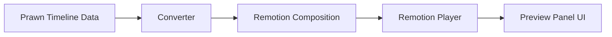
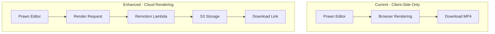
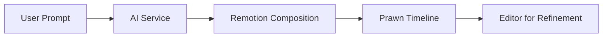

# Remotion Integration Research & Opportunities

> **Research Date:** February 2026  
> **Project:** Prawn Video Editor  
> **Subject:** Remotion framework integration possibilities

---

## Executive Summary

This document explores potential integration opportunities between **Remotion** (a React-based video creation framework) and **Prawn** (a browser-based video editor). After thorough research, I've identified **5 high-value integration opportunities** that could significantly enhance Prawn's capabilities.

### Key Findings

| Integration Opportunity | Value | Complexity | Priority |
|------------------------|-------|------------|----------|
| Enhanced Animation System | ⭐⭐⭐⭐⭐ | Medium | High |
| Remotion Player for Preview | ⭐⭐⭐⭐ | Medium | High |
| Server-Side Cloud Rendering | ⭐⭐⭐⭐⭐ | High | Medium |
| AI-Powered Video Generation | ⭐⭐⭐⭐⭐ | Medium | Medium |
| Motion Graphics Templates | ⭐⭐⭐⭐ | Low | Low |

---

## 1. Remotion Framework Overview

### What is Remotion?

Remotion is a framework that allows developers to create videos programmatically using React. Instead of using traditional video editing software with timelines and drag-and-drop interfaces, you write React components that define what appears at each frame.

### Core Concepts

```typescript
// Remotion's fundamental hook - get current frame number
import { useCurrentFrame, useVideoConfig } from 'remotion';

const MyVideo = () => {
  const frame = useCurrentFrame();  // Current frame number (0, 1, 2, ...)
  const { fps, durationInFrames, width, height } = useVideoConfig();
  
  // Animate based on frame number
  const opacity = frame / 30;  // Fade in over 30 frames
  
  return <div style={{ opacity }}>Hello World</div>;
};
```

### Key Features

| Feature | Description | Relevance to Prawn |
|---------|-------------|-------------------|
| **Frame-based Animation** | `useCurrentFrame()` hook drives all animations | Could enhance current animation system |
| **Spring Physics** | `spring()` function for natural motion | More natural than current easing |
| **Interpolation** | `interpolate()` for smooth value transitions | Cleaner animation code |
| **Player Component** | Embeddable video player with controls | Could replace/augment preview panel |
| **Server-Side Rendering** | Lambda, Cloud Run, Node.js rendering | Offload heavy exports to cloud |
| **Client-Side Rendering** | WebCodecs via mediabunny | Already using this library! |
| **AI Integration** | Agent Skills for Claude Code | AI-powered video generation |

---

## 2. Current Prawn Architecture Analysis

### Rendering Pipeline

Prawn currently uses a custom canvas-based rendering system:

```
Timeline Data → SceneBuilder → RootNode → VisualNode → CanvasRenderer → Export
```

**Key Files:**
- [`SceneExporter`](src/services/renderer/scene-exporter.ts:45) - Handles video export using mediabunny
- [`CanvasRenderer`](src/services/renderer/canvas-renderer.ts:9) - Canvas-based frame rendering
- [`VisualNode`](src/services/renderer/nodes/visual-node.ts:84) - Base class for visual elements with animation support

### Animation System

Prawn's current animation system in [`VisualNode`](src/services/renderer/nodes/visual-node.ts:116):

```typescript
// Current animation calculation
private computeAnimFrame(type: AnimationType, t: number): AnimOverride {
  const eased = 1 - Math.pow(1 - t, 3);  // Cubic ease-out
  
  switch (type) {
    case "fade":
      return { ...ANIM_NEUTRAL, opacityMultiplier: eased };
    case "slide-left":
      return { ...ANIM_NEUTRAL, translateX: (1 - eased) * -300, opacityMultiplier: eased };
    // ... more animation types
  }
}
```

**Current Animation Types:**
- `fade`, `slide-left/right/up/down`, `zoom-in/out`, `spin`, `blur`, `rise`, `fall`, `breathe`, `ken-burns-in/out`

### Export System

Prawn uses **mediabunny** for client-side rendering - the same library Remotion uses for client-side rendering:

```typescript
// From scene-exporter.ts
import { Output, Mp4OutputFormat, CanvasSource, AudioBufferSource } from "mediabunny";

// Frame-by-frame rendering
for (let i = 0; i < frameCount; i++) {
  const time = i / fps;
  await this.renderer.render({ node: rootNode, time });
  await videoSource.add(time, 1 / fps);
}
```

---

## 3. Integration Opportunities

### 3.1 Enhanced Animation System

**Current Gap:** Prawn's animation system uses simple easing functions. Complex animations require manual calculation.

**Remotion Solution:** Use Remotion's `spring()` and `interpolate()` functions for more natural, physics-based animations.

#### Implementation Approach

```typescript
// Option A: Import Remotion's animation utilities
import { spring, interpolate, Easing } from '@remotion/core';

// Enhanced animation calculation
private computeAnimFrame(type: AnimationType, t: number, frame: number, fps: number): AnimOverride {
  // Use spring physics for natural motion
  const springValue = spring({
    frame,
    fps,
    config: { damping: 12, stiffness: 100, mass: 0.5 }
  });
  
  // Use interpolate for smooth transitions
  const opacity = interpolate(frame, [0, 30], [0, 1], {
    extrapolateRight: 'clamp',
    easing: Easing.bezier(0.16, 1, 0.3, 1)
  });
}
```

#### Benefits
- **More natural animations** with spring physics
- **Easier animation authoring** with interpolate helper
- **Consistent timing** across all animations
- **Better easing curves** with bezier support

#### Complexity: Medium
- Requires importing Remotion's animation utilities
- Need to adapt frame-based timing to time-based system
- Animation preview needs to work in real-time

---

### 3.2 Remotion Player for Preview

**Current Gap:** Prawn has a custom preview panel with basic playback controls.

**Remotion Solution:** Use `@remotion/player` for a more feature-rich preview experience.

#### Current Preview Panel

Located in [`src/components/editor/panels/preview/index.tsx`](src/components/editor/panels/preview/index.tsx), the preview panel handles:
- Video playback
- Playhead control
- Canvas rendering

#### Remotion Player Features

```typescript
import { Player } from '@remotion/player';
import { Composition } from 'remotion';

// Remotion Player provides:
// - Timeline scrubbing
// - Playback controls
// - Buffer state management
// - Time display
// - Loop controls
// - Volume control

<Player
  component={MyVideo}
  durationInFrames={300}
  compositionWidth={1920}
  compositionHeight={1080}
  fps={30}
  controls
  loop
/>
```

#### Integration Strategy



**Challenge:** Prawn's timeline data structure differs from Remotion's composition model. Need a converter layer.

#### Benefits
- **Professional playback controls** out of the box
- **Better timeline scrubbing** with frame accuracy
- **Buffer state management** for smooth playback
- **Responsive sizing** with aspect ratio preservation

#### Complexity: Medium
- Need to build timeline-to-composition converter
- Player must reflect real-time timeline changes
- Export must still use existing pipeline

---

### 3.3 Server-Side Cloud Rendering

**Current Gap:** All rendering happens client-side using WebCodecs. Long videos can be slow and resource-intensive.

**Remotion Solution:** Use Remotion Lambda or Cloud Run for server-side rendering.

#### Architecture Options



#### Remotion Lambda Features

| Feature | Description |
|---------|-------------|
| **Serverless** | Pay-per-render, no idle costs |
| **Scalable** | Render multiple videos in parallel |
| **Fast** | Distributed rendering across Lambda functions |
| **Cost-effective** | ~$0.05-0.20 per minute of video |

#### Implementation Approach

```typescript
// 1. Convert Prawn timeline to Remotion composition
const composition = convertTimelineToComposition(timeline);

// 2. Deploy to Lambda
import { renderMediaOnLambda } from '@remotion/lambda';

const result = await renderMediaOnLambda({
  region: 'us-east-1',
  functionName: 'remotion-render',
  composition: 'MyVideo',
  serveUrl: 'https://your-bucket/bundle.zip',
  inputProps: composition,
  codec: 'h264',
  outputLocation: 's3://your-bucket/output/video.mp4'
});

// 3. Return download URL to user
return result.url;
```

#### Benefits
- **Faster exports** for long videos
- **No browser resource limits**
- **Background rendering** - user can close browser
- **Scalable** for batch processing

#### Complexity: High
- AWS infrastructure setup
- Composition bundle deployment
- Progress tracking via polling/webhooks
- Cost management

---

### 3.4 AI-Powered Video Generation

**Current Gap:** Prawn requires manual editing. No AI-assisted content creation.

**Remotion Solution:** Leverage Remotion's AI capabilities (Agent Skills, Claude Code integration).

#### Remotion AI Features

1. **Agent Skills** - Pre-built prompts for Claude Code
2. **Prompt-to-Motion Graphics** - Text to animated video
3. **AI SaaS Template** - Starter kit for AI video products

#### Integration Opportunities



**Use Cases:**

| Feature | Description | Value |
|---------|-------------|-------|
| **Text-to-Video** | Generate video from text prompt | High |
| **Auto-Captions** | Generate animated captions from transcript | High |
| **Template Generation** | Create video templates from description | Medium |
| **Style Transfer** | Apply motion graphics style to content | Medium |

#### Implementation Approach

```typescript
// Option 1: Use Remotion's AI template approach
import { generateComposition } from '@/lib/ai';

const composition = await generateComposition({
  prompt: "Create a 30-second product showcase video",
  assets: uploadedImages,
  style: "modern-minimal"
});

// Convert to Prawn timeline format
const timeline = convertCompositionToTimeline(composition);

// Option 2: Integrate with existing AI services
// See docs/backend-ai-services.md for current AI infrastructure
```

#### Benefits
- **Faster content creation** - generate videos from prompts
- **Lower barrier to entry** - non-experts can create videos
- **Consistent quality** - AI follows best practices
- **Iterative refinement** - AI generates, user refines

#### Complexity: Medium
- AI service integration (OpenAI, Claude, etc.)
- Prompt engineering for video generation
- Composition-to-timeline conversion

---

### 3.5 Motion Graphics Templates

**Current Gap:** Users must create animations from scratch. No template system.

**Remotion Solution:** Use Remotion's composition system for reusable templates.

#### Template System Architecture

```typescript
// Define reusable motion graphics templates
interface MotionTemplate {
  id: string;
  name: string;
  category: 'intro' | 'outro' | 'lower-third' | 'transition' | 'overlay';
  duration: number;
  parameters: TemplateParameter[];
  composition: React.FC<TemplateProps>;
}

// Example: Lower Third Template
const LowerThirdTemplate: MotionTemplate = {
  id: 'lower-third-modern',
  name: 'Modern Lower Third',
  category: 'lower-third',
  duration: 5,
  parameters: [
    { name: 'title', type: 'string', default: 'Your Name' },
    { name: 'subtitle', type: 'string', default: 'Your Title' },
    { name: 'accentColor', type: 'color', default: '#3B82F6' }
  ],
  composition: ({ title, subtitle, accentColor }) => (
    <AbsoluteFill>
      <AnimatedBar color={accentColor} />
      <AnimatedText text={title} />
      <AnimatedText text={subtitle} delay={0.3} />
    </AbsoluteFill>
  )
};
```

#### UI Integration

Add a **Templates** panel to the left toolbar:

```
Left Toolbar Panel
├── Media (existing)
├── Sounds (existing)
├── Text (existing)
├── Stickers (existing)
├── Templates (NEW) ← Motion graphics templates
├── Effects (placeholder)
├── Transitions (placeholder)
└── ...
```

#### Benefits
- **Faster video creation** - drag-and-drop templates
- **Consistent branding** - reusable style templates
- **Professional quality** - pre-designed animations
- **Customizable** - parameter-driven templates

#### Complexity: Low
- Template data structure design
- Template browser UI
- Template-to-timeline conversion

---

## 4. Technical Compatibility Analysis

### Shared Technologies

| Technology | Prawn | Remotion | Compatibility |
|------------|-------|----------|---------------|
| React | ✅ v19 | ✅ v18+ | ✅ Compatible |
| TypeScript | ✅ | ✅ | ✅ Compatible |
| mediabunny | ✅ | ✅ | ✅ Same library |
| Canvas API | ✅ | ✅ | ✅ Compatible |
| WebCodecs | ✅ | ✅ | ✅ Compatible |
| Next.js | ✅ v16 | ✅ Supported | ✅ Compatible |

### Key Differences

| Aspect | Prawn | Remotion |
|--------|-------|----------|
| **Rendering** | Time-based (seconds) | Frame-based (frame numbers) |
| **Timeline** | Multi-track editor | Single composition |
| **Preview** | Custom canvas | Player component |
| **Export** | Client-side only | Client + Server options |
| **Animation** | Custom easing | Spring + interpolate |

### Integration Challenges

1. **Time vs Frame-based:** Prawn uses seconds, Remotion uses frames
   - Solution: Converter layer with FPS awareness

2. **Timeline vs Composition:** Different data models
   - Solution: Bidirectional converter

3. **Real-time Editing:** Remotion designed for pre-defined compositions
   - Solution: Dynamic composition updates

---

## 5. Recommended Implementation Roadmap

### Phase 1: Animation Enhancement (Quick Win)

**Goal:** Improve animation quality with minimal changes

**Tasks:**
1. Install `@remotion/core` for animation utilities
2. Import `spring()` and `interpolate()` functions
3. Enhance [`computeAnimFrame()`](src/services/renderer/nodes/visual-node.ts:145) with spring physics
4. Add advanced easing options to animation UI

**Deliverables:**
- Spring-based animations option
- Better easing curves
- Improved animation preview

### Phase 2: Motion Graphics Templates

**Goal:** Add template system for faster video creation

**Tasks:**
1. Design template data structure
2. Create template browser UI
3. Build 5-10 starter templates
4. Implement template-to-timeline conversion

**Deliverables:**
- Templates panel in left toolbar
- Intro/outro templates
- Lower third templates
- Transition templates

### Phase 3: AI-Powered Generation

**Goal:** Enable AI-assisted video creation

**Tasks:**
1. Integrate with AI service (Claude/OpenAI)
2. Build prompt-to-composition generator
3. Create composition-to-timeline converter
4. Add AI generation UI

**Deliverables:**
- "Generate Video" feature
- Text-to-video capability
- Auto-caption generation

### Phase 4: Cloud Rendering (Optional)

**Goal:** Offload heavy exports to cloud

**Tasks:**
1. Set up Remotion Lambda infrastructure
2. Build timeline-to-composition bundler
3. Create render job queue
4. Add progress tracking UI

**Deliverables:**
- Cloud render option in export dialog
- Background rendering
- Download when complete

---

## 6. Cost-Benefit Analysis

### Animation Enhancement

| Factor | Assessment |
|--------|------------|
| Development Effort | Low (1-2 weeks) |
| User Value | High |
| Risk | Low |
| Dependencies | Minimal |
| **Recommendation** | ✅ Proceed immediately |

### Motion Graphics Templates

| Factor | Assessment |
|--------|------------|
| Development Effort | Medium (2-4 weeks) |
| User Value | High |
| Risk | Low |
| Dependencies | None |
| **Recommendation** | ✅ Proceed after Phase 1 |

### AI-Powered Generation

| Factor | Assessment |
|--------|------------|
| Development Effort | Medium (3-5 weeks) |
| User Value | Very High |
| Risk | Medium (AI costs, quality) |
| Dependencies | AI service subscription |
| **Recommendation** | ✅ Proceed after Phase 2 |

### Cloud Rendering

| Factor | Assessment |
|--------|------------|
| Development Effort | High (4-8 weeks) |
| User Value | Medium (for long videos) |
| Risk | Medium (AWS complexity) |
| Dependencies | AWS account, Remotion license |
| **Recommendation** | ⏸️ Consider based on user demand |

---

## 7. Alternative Approaches

### Option A: Full Remotion Integration

Convert Prawn to use Remotion as the core rendering engine.

**Pros:**
- Access to all Remotion features
- Future-proof with Remotion updates

**Cons:**
- Major architectural change
- May lose some flexibility
- Higher complexity

### Option B: Selective Feature Adoption (Recommended)

Import only specific Remotion utilities while keeping Prawn's architecture.

**Pros:**
- Minimal disruption
- Incremental adoption
- Lower risk

**Cons:**
- Some features may not integrate perfectly
- May need custom adapters

### Option C: Parallel Tracks

Keep Prawn's current system and add Remotion as an alternative mode.

**Pros:**
- No changes to existing functionality
- Users can choose approach

**Cons:**
- Maintenance burden
- Confusing UX

---

## 8. Conclusion

Remotion offers several compelling integration opportunities for Prawn:

1. **Animation Enhancement** - The most immediate value with minimal effort. Spring physics and better interpolation would significantly improve animation quality.

2. **Motion Graphics Templates** - High user value with moderate effort. Templates would differentiate Prawn from other browser-based editors.

3. **AI-Powered Generation** - Strategic feature that could attract new users. Leverages the current AI trend while providing real utility.

4. **Cloud Rendering** - Valuable for power users but requires significant infrastructure investment. Consider based on user demand.

**Recommendation:** Start with **Phase 1 (Animation Enhancement)** as a proof-of-concept, then proceed to **Phase 2 (Templates)** and **Phase 3 (AI Generation)** based on user feedback.

---

## Appendix: Resources

### Remotion Documentation
- Main Docs: https://www.remotion.dev/docs/
- Player: https://www.remotion.dev/docs/player
- Animation: https://www.remotion.dev/docs/animating-properties
- Lambda: https://www.remotion.dev/docs/lambda
- AI Integration: https://www.remotion.dev/docs/ai/

### Prawn Files Referenced
- [`src/services/renderer/scene-exporter.ts`](src/services/renderer/scene-exporter.ts) - Export pipeline
- [`src/services/renderer/canvas-renderer.ts`](src/services/renderer/canvas-renderer.ts) - Canvas rendering
- [`src/services/renderer/nodes/visual-node.ts`](src/services/renderer/nodes/visual-node.ts) - Animation system
- [`src/types/timeline.ts`](src/types/timeline.ts) - Timeline data structures
- [`plans/left-toolbar-features-feasibility.md`](plans/left-toolbar-features-feasibility.md) - Related feature analysis
