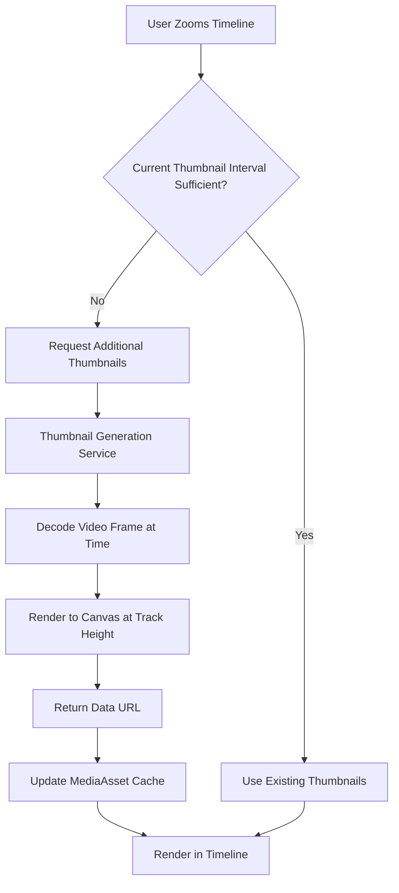

# Timeline Thumbnail Improvement Plan

## Problem Statement

Currently, when the timeline is zoomed, thumbnails in video clips get scaled up horizontally, causing:
1. **Pixelation** - Thumbnails stretch in width, becoming blurry
2. **Cut off from top/bottom** - Fixed-height thumbnails get clipped when container scales

### Current Implementation Analysis

**Thumbnail Generation** (`src/lib/media/processing.ts`):
- `generateFilmstripThumbnails()` creates thumbnails at 1-second intervals
- Each thumbnail is generated with fixed height (100px) and calculated width based on aspect ratio
- `filmstripInterval` is set to 1 second during upload

**Timeline Rendering** (`src/components/editor/panels/timeline/timeline-element.tsx`):
- Line 472-480: Calculates thumbnail width as `interval * PIXELS_PER_SECOND * zoomLevel`
- This causes horizontal stretching when zoom increases
- Uses adaptive density (step) to skip thumbnails when zoomed out, but not when zoomed in

**Key Constants**:
- `PIXELS_PER_SECOND = 50`
- `ZOOM_MAX = 100`
- `TRACK_HEIGHTS.video = 80px`

---

## Proposed Solution

### Core Changes

1. **Height-Fitted Thumbnails**: Always fit thumbnail height to track height, stretch width to fill the time interval
2. **Dynamic Thumbnail Density**: Generate more thumbnails when zoomed in to maintain visual quality
3. **On-Demand Generation**: Generate thumbnails on-the-fly when needed for current viewport

### Architecture Overview



---

## Implementation Steps

### Step 1: Update Thumbnail Rendering in Timeline Element

**File**: `src/components/editor/panels/timeline/timeline-element.tsx`

**Changes**:
- Modify `ElementContent` function to use height-fitted rendering
- Change from `width: ${width}px` to `height: 100%` with `object-fit: cover`
- Calculate number of visible thumbnails based on zoom level

**Current Code** (lines 486-497):
```tsx

```

**New Code**:
```tsx

```

### Step 2: Add On-Demand Thumbnail Generation Hook

**New File**: `src/hooks/timeline/use-on-demand-thumbnails.ts`

**Functionality**:
- Monitor visible time range based on scroll position and zoom
- Calculate required thumbnail density for current viewport
- Generate missing thumbnails on-demand using video frame extraction
- Cache generated thumbnails in media asset store

**Interface**:
```typescript
interface ThumbnailRequest {
  mediaId: string;
  timeInSeconds: number;
  height: number; // Track height
}

function useOnDemandThumbnails(zoomLevel: number, scrollLeft: number): void;
```

### Step 3: Update Filmstrip Thumbnail Generation

**File**: `src/lib/media/processing.ts`

**Enhancements**:
- Add parameter for target thumbnail width (based on zoom level)
- Generate higher density thumbnails (every 0.5s or 0.25s) for better quality when zoomed
- Consider generating at multiple densities and selecting appropriate set

**New Function**:
```typescript
export async function generateThumbnailAtTime({
  videoFile: File,
  timeInSeconds: number,
  height: number,
  width?: number, // Optional, calculates from aspect ratio if not provided
}): Promise<string>
```

### Step 4: Optimize Thumbnail Storage and Retrieval

**File**: `src/services/storage/types.ts` (MediaAsset type)

**Add to MediaAsset**:
```typescript
interface MediaAsset {
  // ... existing fields
  thumbnailCache?: Map<number, string>; // time -> thumbnail data URL
  thumbnailDensity?: number; // seconds between thumbnails
}
```

### Step 5: Implement Viewport-Based Thumbnail Strategy

**Approach**: Calculate visible time range and generate only needed thumbnails

**Algorithm**:
1. Get viewport width and scroll position
2. Calculate visible time range: `[startTime, endTime]`
3. Determine optimal thumbnail interval based on zoom:
   - `zoom < 2`: 1 second interval (existing)
   - `zoom 2-5`: 0.5 second interval
   - `zoom 5-10`: 0.25 second interval
   - `zoom > 10`: 0.1 second interval
4. Generate missing thumbnails for visible range only
5. Prune cache for non-visible ranges to manage memory

---

## Alternative Approaches Considered

### Option A: Pre-generate High-Density Thumbnails
- Generate thumbnails at 0.1s interval during upload
- **Pros**: No loading delay when zooming
- **Cons**: Memory usage grows significantly (10x more thumbnails for 10s video = 100 thumbnails)

### Option B: Hybrid Approach
- Keep 1s interval for initial display
- Background-generate higher density thumbnails progressively
- **Pros**: Fast initial load, improves over time
- **Cons**: More complex implementation

### Option C: Canvas-Based Rendering (Recommended)
- Render thumbnails directly to canvas based on visible viewport
- Only render what's visible
- **Pros**: Memory efficient, always crisp
- **Cons**: Requires significant refactoring

---

## Recommended Implementation Path

### Phase 1: Quick Fix (Low Effort)
1. Fix height-fitting in CSS (object-fit: cover)
2. Increase initial thumbnail density to 0.5s
3. Accept slightly higher memory usage

### Phase 2: On-Demand Generation (Medium Effort)
1. Implement viewport-based thumbnail generation hook
2. Add thumbnail caching layer
3. Generate on scroll/zoom

### Phase 3: Optimization (Future)
1. Web Worker for thumbnail generation
2. Progressive loading with placeholder
3. Memory management and cache eviction

---

## Files to Modify

| File | Changes |
|------|---------|
| `src/components/editor/panels/timeline/timeline-element.tsx` | Fix thumbnail rendering to be height-fitted |
| `src/lib/media/processing.ts` | Add on-demand thumbnail generation function |
| `src/types/assets.ts` or `src/services/storage/types.ts` | Add thumbnail cache to MediaAsset |
| `src/hooks/timeline/use-on-demand-thumbnails.ts` | New hook for viewport-based generation |
| `src/constants/timeline-constants.tsx` | Optional: add thumbnail density config |

---

## Performance Considerations

1. **Memory**: Thumbnail data URLs can be large; implement cache eviction
2. **CPU**: Video decoding is expensive; debounce zoom/scroll handlers
3. **Network**: If thumbnails stored remotely, consider lazy loading
4. **UI**: Show loading state while generating thumbnails

---

## Testing Checklist

- [ ] Zoom in/out maintains thumbnail quality
- [ ] Thumbnails fill track height properly
- [ ] No cut-off at top/bottom of thumbnails
- [ ] Smooth scrolling with many thumbnails
- [ ] Memory usage stays reasonable with long videos
- [ ] Works with both video and image assets
- [ ] Handles trim start/end correctly

---

## Next Steps

1. Approve this plan
2. Begin Phase 1 implementation (height-fitting CSS fix + increased initial density)
3. Then proceed to Phase 2 for on-demand generation
